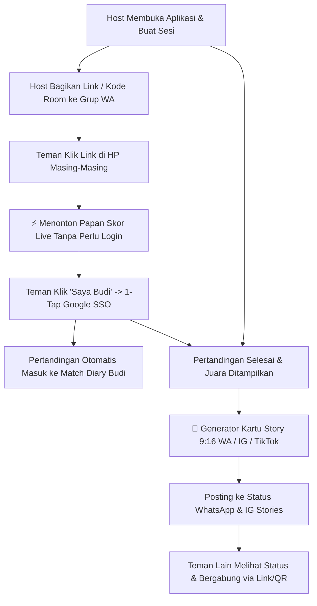

# Product Requirement Document (PRD) - Game Night Suite

## 1. Latar Belakang & Visi Produk
Permainan meja fisik (*tabletop games*) seperti permainan kartu tradisional (**Truf/Trup**, **Remi 7-Kartu**, **Omben/Cangkulan**), catur, dan board game merupakan aktivitas sosial yang sangat populer di Indonesia dan dunia. Namun, sesi bermain seringkali terhambat oleh masalah praktis:
- Kehilangan kertas/pulpen untuk mencatat skor.
- Perhitungan rumus skor yang rumit dan rawan salah hitung (seperti Main Atas & Main Bawah pada Truf, atau hitungan denda kartu pada Remi).
- Ketiadaan jam catur (*chess clock*) saat ingin bertanding catur cepat (*Blitz/Rapid*).
- Ketiadaan dadu atau penentu siapa yang jalan/mulai duluan (*first player picker*).
- Hilangnya riwayat permainan seru yang dimainkan bersama teman-teman di masa lalu.

**Game Night Suite** hadir sebagai **All-in-One Tabletop & Card Game Companion** berbasis web (PWA) dan mobile native (Capacitor) yang ringan, instan, multi-bahasa, dan multi-tenant. Aplikasi ini dirancang untuk **pertumbuhan viral (High MAU)** dengan menghilangkan hambatan pendaftaran (*frictionless guest play*), sinkronisasi multi-perangkat (*real-time room*), fitur klaim kursi 1-tap (*1-tap Google SSO*), buku harian pertandingan (*personal match diary*), dan generator kartu status media sosial 9:16 (*WhatsApp Status & Instagram Stories*).

---

## 2. Target Pengguna & Strategi Pertumbuhan Viral

### 2.1. Target Pengguna
1. **Pemain Kartu Rekreasional & Kompetitif**: Komunitas dan kelompok pertemanan yang rutin bermain Truf, Remi, dan Omben di kafe, pos ronda, atau rumah.
2. **Pemain Catur & Board Game**: Pemain catur yang membutuhkan jam catur split-screen dengan kontrol waktu FIDE (Fischer Increment) serta pemain board game (Catan, Scrabble, Uno, Gaple).
3. **Game Host / Penyelenggara Game Night**: Orang yang memimpin sesi permainan dan mencatat skor untuk teman-temannya.

### 2.2. Viral Growth Loops (Faktor K > 1)

---

## 3. Fitur Utama & Kebutuhan Fungsional

### 3.1. Hub Utama & Buku Harian Pertandingan (Home Dashboard & Match Diary)
- **Game Launcher Grid**: Akses instan 1-klik ke semua modul game (Truf, Remi, Omben, Chess Clock, Papan Skor, Dadu, Finger Chooser).
- **Recent Match Diary Widget**: Menampilkan kartu riwayat pertandingan terbaru (baik sesi yang di-host sendiri maupun sesi di mana user bergabung sebagai pemain).
- **Quick Rematch**: Tombol untuk langsung memulai pertandingan ulang dengan susunan pemain dan aturan yang sama dalam 1-klik.
- **Statistik Personal**: Total pertandingan, win-rate, dan game favorit.

---

### 3.2. Modul 1: Truf (Trup) Score Tracker
- **Pemain**: Tepat 4 pemain, 13 trik per ronde.
- **Fase Permainan**:
  1. **Fase Bid (Penawaran)**:
     - Input bid (0–13) untuk ke-4 pemain.
     - Penentu jenis kembang Truf (Bid tertinggi; jika seri, tiebreaker: Sekop ♠ > Hati ♥ > Wajik ♦ > Keriting ♣ > Tanpa Truf 🚫).
     - Indikator dealer otomatis berputar searah jarum jam.
     - **Aturan Bid 13**: Deteksi otomatis jika total bid = 13. Menampilkan modal keputusan bagi penawar terakhir untuk memilih mode *"Paksa Main Atas"* atau *"Paksa Main Bawah"*.
  2. **Fase Won (Hasil Kemenangan Trik)**:
     - Input jumlah kemenangan (0–13).
     - Validasi otomatis: Total trik ke-4 pemain harus tepat 13.
- **Kalkulasi Skor Otomatis**:
  - Klasifikasi otomatis: **Main Atas** (Total Bid > 13) vs **Main Bawah** (Total Bid < 13).
  - Formula akurat dengan penalti kurang trik (*lack multiplier*) dan denda kelebihan trik (*excess multiplier*), bonus Bid 0 sukses, dan penalti Bid 0 gagal.
- **Papan Skor & Kontrol**: Leaderboard dinamis real-time, tabel riwayat ronde, tombol Undo ronde, dan selesaikan game.

---

### 3.3. Modul 2: Remi (Indonesian 7-Card / Rummy)
- **Pemain**: 2 hingga 6 pemain (default 4 pemain).
- **Mekanika Kombinasi**: Seri Kembang (*Straight Flush*) dan 3/4 Kartu Kembar (*Sets*).
- **Mode Penyelesaian Ronde**:
  - **Tutup Biasa (Normal Close)**: Pemenang ronde mendapat denda 0. Pemain lain mencatat total denda kartu yang tersisa di tangan.
  - **Tutup Murni / Remi**: Menutup tanpa pernah membuka kartu sebelumnya (Denda ganda untuk lawan / bonus khusus).
  - **Remi Cacing / Remi 13**: Dukungan aturan variasi lokal dengan multiplier bonus/denda.
- **Keypad Kalkulator Denda Cepat**:
  - Tombol sentuh cepat untuk nilai kartu standar Indonesia: As (15 poin), K/Q/J (10 poin), angka 2–10 (sesuai nominal), Joker (25 atau 50 poin).
  - Auto-sum nilai kartu tanpa perlu menghitung manual di kepala.
- **Ambang Eliminasi (*Game Over Threshold*)**: Peringatan dan penguncian saat pemain mencapai batas denda maksimum (contoh: 500 atau 1000 poin).

---

### 3.4. Modul 3: Omben (Indonesian Cangkulan Card Game)
- **Pemain**: 2 hingga 6 pemain (default 4 pemain).
- **Mekanika**: Permainan buang kartu (*card-shedding*) di mana pemain wajib mengikuti kembang kartu pertama (*lead suit*); jika tidak punya, wajib mengambil kartu dari tumpukan (*"cangkul"* / *"ngomben"*).
- **Pencatatan Ronde**:
  - **Urutan Selesai (*Finishing Rank*)**: Mencatat pemain yang menghabiskan kartu pertama kali (**Juara 1 / Out**), ke-2, ke-3, dan pemain terakhir yang memegang kartu (**Kena "Omben" / Kalah**).
  - **Input Denda Kartu (Opsional)**: Mencatat jumlah lembar sisa kartu yang tertinggal di tangan.
  - **Tally Akumulasi Omben**: Menghitung akumulasi total kekalahan "Omben" tiap pemain sepanjang sesi.
  - **Batas Kalah**: Peringatan saat pemain mencapai batas Omben yang disepakati (contoh: 5 kali Omben) untuk menentukan hukuman/traktir.

---

### 3.5. Modul 4: Dual Split-Screen Chess Clock
- **Tampilan Split-Screen**: Layar terbagi 2 bagian besar. Area tap Pemain 1 diputar 180° menghadap atas sehingga HP dapat diletakkan mendatar di tengah meja catur di antara 2 pemain.
- **Preset FIDE & Kustom**:
  - **Bullet**: 1m+0s, 1m+1s, 2m+1s.
  - **Blitz**: 3m+0s, 3m+2s, 5m+0s, 5m+3s.
  - **Rapid**: 10m+0s, 15m+10s, 30m+0s.
  - **Kustom**: Menit awal + Tambahan Waktu (*Fischer Increment*) atau *Simple Delay*.
- **Integrasi Perangkat Keras**:
  - **Haptik**: Getaran fisik saat layar disentuh untuk mengoper giliran.
  - **Audio Web**: Suara klik mekanikal saat pergantian giliran dan peringatan bunyi saat waktu tersisa < 10 detik.
  - **Screen Wake-Lock**: Mencegah layar HP mati/terkunci otomatis saat pertandingan catur berlangsung.

---

### 3.6. Modul 5: Papan Skor Generik (2–8 Pemain)
- Papan pencatat skor serbaguna untuk segala permainan (Uno, Gaple, Scrabble, Mahjong, Yahtzee).
- Tombol stepper cepat: `+1`, `+5`, `+10`, `-1`, `-5`, dan input custom delta.
- Podium peringkat live dengan mahkota juara dan tabel histori perubahan skor tiap ronde.

---

### 3.7. Modul 6: Tabletop Utilities (Alat Meja Cepat)
- **Dadu 3D/2D**: Melempar 1 hingga 6 dadu standar (D6) atau dadu RPG (D4, D8, D10, D12, D20) dengan animasi fisik acak.
- **Finger Chooser ("Siapa yang Mulai?")**: 2–6 pemain menempelkan satu jari ke layar HP secara bersamaan. Lingkaran neon muncul di bawah setiap jari; setelah 3 detik, sistem memilih 1 jari secara acak dengan animasi glowing neon.
- **Lempar Koin (Coin Flipper)**: Animasi 3D lempar koin (Gambar / Angka).

---

### 3.8. Fitur Sosial & Berbagi (Viral Growth Engine)
- **Live Spectator Room**: Setiap sesi memiliki kode unik 6-karakter (misal: `ROOM: TRUF88`). Teman dapat membuka link di browser HP mereka untuk melihat pembaruan skor secara live (*Supabase Realtime*) tanpa perlu login.
- **1-Tap Seat Claiming**: Penonton dapat memilih kursi mereka (*"Saya Pemain 2: Budi"*) dan login via Google 1-Tap untuk menyimpan pertandingan ke akun permanen mereka.
- **9:16 "Flex & Share" Story Card Generator**:
  - Mengekspor kartu gambar resolusi tinggi format 9:16 vertikal untuk **Status WhatsApp, Instagram Stories, dan TikTok**.
  - Berisi: Podium Juara, Badge MVP, Statistik Kunci, Tanggal, dan Watermark/QR Code link bergabung.
  - Menggunakan *Web Share API* (`navigator.share`) untuk langsung membuka share sheet OS ke WhatsApp/Instagram.

---

### 3.9. Portal Web Admin (`role = 'admin'`)
- Akses khusus bagi akun dengan role admin:
  - **Ringkasan Analitik**: Total pengguna terdaftar, total game yang dimainkan per tipe (Truf, Remi, Omben, Chess, Scoreboard), grafik sesi aktif harian/mingguan.
  - **Manajemen Pengguna**: Direktori pengguna dengan fitur pencarian email/nama dan tombol pengalihan hak akses admin (*role promotion/demotion*).
  - **Session Explorer**: Alat inspeksi sesi game aktif dan selesai untuk monitoring platform.
  - **Pengumuman Sistem**: Pengaturan banner notifikasi / jadwal pemeliharaan yang tampil di seluruh klien aktif.

---

### 3.10. Mesin Multi-Bahasa (i18n)
- Dukungan penuh: **Bahasa Indonesia (`id`)** dan **English (`en`)**.
- Deteksi otomatis bahasa perangkat (`navigator.language`) dan penyimpanan preferensi di `localStorage`.
- Desain kamus berbasis JSON yang modular sehingga penambahan bahasa baru di masa depan (contoh: Bahasa Jawa `jv.json`, Spanyol `es.json`) dapat dilakukan dengan mudah.

---

## 4. Kebutuhan Non-Fungsional

1. **Performa Web (Sub-Second FCP)**: Ukuran bundle aplikasi di bawah 200KB agar First Contentful Paint (FCP) di bawah 300ms pada jaringan seluler 3G/4G Indonesia.
2. **Desain Mobile-First & Touch-Friendly**: Target sentuh tombol minimal 48x48px, tema gelap elegan (*Dark Theme* & *Glassmorphism*), dan tipografi modern (Outfit/Poppins).
3. **Offline & Guest-First**: Seluruh alat (Chess Clock, Dadu, Finger Chooser, Papan Skor Lokal) dapat digunakan 100% secara instan tanpa koneksi internet dan tanpa login.
4. **Keamanan & Isolasi Multi-Tenant**: Menggunakan Supabase Row Level Security (RLS) dengan autentikasi Google OAuth & Email.
5. **Dukungan Mobile Native**: Konfigurasi Capacitor untuk build Android APK/AAB dan iOS IPA dengan haptik dan wake-lock bawaan.
