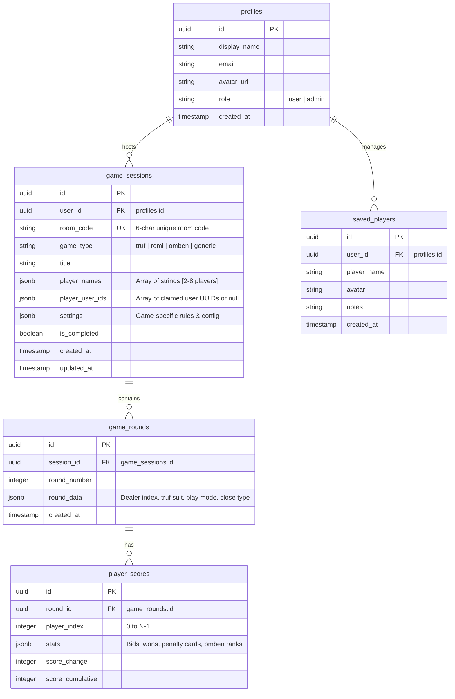
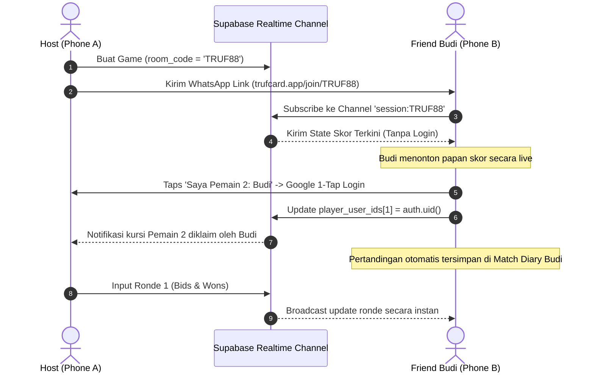

# System Architecture & Technical Specification - Game Night Suite

## 1. Arsitektur Sistem & Topologi Teknologi

Aplikasi ini menggunakan arsitektur **Jamstack + Realtime BaaS** yang dioptimalkan untuk performa web sub-second dan eksekusi mobile native (Android & iOS) melalui Capacitor.

```mermaid
graph TD
    subgraph Client Ecosystem
        Web[Web Client Chrome/Safari/Firefox]
        PWA[PWA Installed Mobile Client]
        CapAndroid[Capacitor Native Android APK/AAB]
        CapiOS[Capacitor Native iOS IPA]
    end

    subgraph CDN & Hosting
        Vercel[Vercel Global Edge Network]
    end

    subgraph Client Architecture React 19 + Vite
        Router[Router & Auth Gate]
        I18n[i18n Engine ID / EN]
        Hub[Home Hub & Match Diary]
        Admin[Web Admin Portal]
        Truf[Truf Engine]
        Remi[Remi Engine]
        Omben[Omben Engine]
        Chess[Chess Clock Engine]
        Score[Generic Scoreboard]
        Utils[Tabletop Utilities]
        Share[9:16 Story Card Generator]
    end

    subgraph Supabase Platform
        Auth[Supabase Auth Google OAuth + Email]
        Postgres[(PostgreSQL with RLS Multi-Tenancy)]
        Realtime[Supabase Realtime WebSocket Channels]
    end

    Web & PWA --> Vercel --> Client Architecture
    CapAndroid & CapiOS --> Client Architecture

    Router & Hub & Admin & Truf & Remi & Omben & Score --> Auth
    Auth --> Postgres
    Truf & Remi & Omben & Score <--> Realtime
```

### Stack Teknologi:
- **Core Framework**: React 19 dengan Vite 8.
- **Styling**: Vanilla CSS Design System dengan Glassmorphism, CSS Custom Properties, HSL color tokens, dan responsive breakpoints.
- **State & Realtime Sync**: React Context + Supabase JS Client (`@supabase/supabase-js`) dengan Postgres Changes WebSocket channels.
- **Hardware & Perangkat Keras**:
  - Haptik: Web Vibration API + `@capacitor/haptics`.
  - Audio: Web Audio API (Synthesized tone generator untuk klik, peringatan <10 detik, dan bel ronde).
  - Screen Wake-Lock: Screen Wake Lock API + `@capacitor-community/keep-awake`.
  - Share Sheet: Web Share API (`navigator.share`) + Canvas 9:16 PNG renderer.
- **Mobile Container**: Capacitor 6 / 7 (`@capacitor/core`, `@capacitor/android`, `@capacitor/ios`).
- **Database & Backend**: Supabase (PostgreSQL 15+, Row Level Security, Triggers, Auth SSO).

---

## 2. Skema Database Lengkap (PostgreSQL / Supabase)

Database dirancang dengan isolasi multi-tenant penuh, fleksibilitas 2–8 pemain untuk semua tipe game, dukungan kode room publik untuk spectating, dan peran administrator (`role = 'admin'`).



### 2.1. Tabel `public.profiles`
```sql
create table public.profiles (
  id uuid references auth.users on delete cascade primary key,
  display_name text not null,
  email text unique,
  avatar_url text,
  role text not null default 'user' check (role in ('user', 'admin')),
  created_at timestamptz default now() not null
);

alter table public.profiles enable row level security;
create policy "Users can view own profile" on public.profiles for select using (auth.uid() = id);
create policy "Admins can view all profiles" on public.profiles for select using (
  exists (select 1 from public.profiles where id = auth.uid() and role = 'admin')
);
create policy "Users can update own profile" on public.profiles for update using (auth.uid() = id);
```

### 2.2. Tabel `public.game_sessions`
```sql
create table public.game_sessions (
  id uuid default gen_random_uuid() primary key,
  user_id uuid references public.profiles(id) on delete cascade not null,
  room_code text unique, -- 6-character unique room code e.g. 'TRUF88'
  game_type text not null check (game_type in ('truf', 'remi', 'omben', 'generic')),
  title text not null default 'Game Night Session',
  player_names jsonb not null, -- Array of strings e.g. ["Budi", "Siti", "Andi", "Eko"]
  player_user_ids jsonb default '[]'::jsonb, -- Claimed UUIDs [uuid1, null, uuid3, null]
  settings jsonb not null default '{
    "multiplier": 1,
    "bid0Bonus": 0,
    "prevent13": false,
    "bid13Decision": true,
    "atasLackMult": -2,
    "atasExcessMult": -1,
    "bawahLackMult": -1,
    "bawahExcessMult": -2,
    "remiTargetPenalty": 500,
    "remiTutupMurniDouble": true,
    "ombenTargetLoss": 5
  }'::jsonb,
  is_completed boolean default false not null,
  created_at timestamptz default now() not null,
  updated_at timestamptz default now() not null
);

alter table public.game_sessions enable row level security;
-- Izin publik membaca jika sesi memiliki room_code (untuk spectating tanpa login)
create policy "Anyone can view sessions with room code" on public.game_sessions 
  for select using (true);

-- Host mengelola penuh sesi miliknya
create policy "Hosts manage own sessions" on public.game_sessions 
  for all using (auth.uid() = user_id);

-- Pemain yang login dapat mengklaim slot kursi mereka
create policy "Claimed players can update claimed slot" on public.game_sessions 
  for update using (auth.uid() is not null);
```

### 2.3. Tabel `public.game_rounds` & `public.player_scores`
```sql
create table public.game_rounds (
  id uuid default gen_random_uuid() primary key,
  session_id uuid references public.game_sessions(id) on delete cascade not null,
  round_number integer not null,
  round_data jsonb not null default '{}'::jsonb, -- e.g. { "dealerIndex": 0, "trufSuit": 0, "playMode": "atas" }
  created_at timestamptz default now() not null,
  unique (session_id, round_number)
);

create table public.player_scores (
  id uuid default gen_random_uuid() primary key,
  round_id uuid references public.game_rounds(id) on delete cascade not null,
  player_index integer not null check (player_index >= 0),
  stats jsonb not null default '{}'::jsonb, -- e.g. { "bid": 3, "won": 3 } or { "penaltyCards": 45 } or { "isOmben": true }
  score_change integer not null,
  score_cumulative integer not null,
  unique (round_id, player_index)
);

alter table public.game_rounds enable row level security;
create policy "Anyone can view rounds of public room" on public.game_rounds for select using (true);
create policy "Hosts manage rounds" on public.game_rounds for all using (
  exists (select 1 from public.game_sessions where id = game_rounds.session_id and user_id = auth.uid())
);

alter table public.player_scores enable row level security;
create policy "Anyone can view player scores of public room" on public.player_scores for select using (true);
create policy "Hosts manage player scores" on public.player_scores for all using (
  exists (
    select 1 from public.game_rounds 
    join public.game_sessions on game_sessions.id = game_rounds.session_id
    where game_rounds.id = player_scores.round_id and game_sessions.user_id = auth.uid()
  )
);
```

---

## 3. Rumus & Logika Matematika Permainan

### 3.1. Rumus Skor Truf (Trup)
```javascript
export function calculateTrufRoundScores(bids, wons, settings, totalBid, forcedMode = null) {
  const isMainAtas = forcedMode ? forcedMode === 'atas' : totalBid > 13;
  const mult = settings.multiplier || 1;
  const bonus0 = settings.bid0Bonus || 0;
  
  return bids.map((bid, index) => {
    const won = wons[index];
    const diff = Math.abs(won - bid);
    let scoreChange = 0;
    
    if (won === bid) {
      // Sukses mencapai target
      if (bid === 0) {
        scoreChange = bonus0 * mult;
      } else {
        scoreChange = bid * mult;
      }
    } else {
      // Gagal mencapai target
      if (bid === 0) {
        scoreChange = won * (settings.atasLackMult || -2) * mult;
      } else {
        if (won < bid) {
          const lackMultiplier = isMainAtas ? (settings.atasLackMult || -2) : (settings.bawahLackMult || -1);
          scoreChange = diff * lackMultiplier * mult;
        } else {
          const excessMultiplier = isMainAtas ? (settings.atasExcessMult || -1) : (settings.bawahExcessMult || -2);
          scoreChange = diff * excessMultiplier * mult;
        }
      }
    }
    return scoreChange;
  });
}
```

### 3.2. Rumus Denda Remi (Indonesian 7-Card / Rummy)
- **Nilai Kartu Standar**:
  - As: 15 poin
  - King, Queen, Jack: 10 poin
  - Angka 2–10: sesuai angka nominal (2 = 2 poin, ..., 10 = 10 poin)
  - Joker: 25 atau 50 poin
- **Perhitungan Skor Ronde**:
  - Pemenang yang berhasil menutup (*Close*): `scoreChange = 0` (atau bonus positif jika aturan kustom).
  - Pemain yang kalah (*Tutup Biasa*): `scoreChange = -(totalNilaiKartuDiTangan)`.
  - Pemain yang kalah saat lawan *Tutup Murni / Remi*: `scoreChange = -(totalNilaiKartuDiTangan * 2)`.

### 3.3. Logika Skor Omben (Cangkulan Card Game)
- **Pencatatan Ronde**:
  - Juara 1 (*Winner / Out*): Mendapat status Juara 1, `isOmben = false`, `penaltyCards = 0`.
  - Juara 2 & 3: Mendapat ranking sesuai urutan buang kartu, `isOmben = false`, `penaltyCards = sisaKartu`.
  - Posisi Terakhir: Mendapat status **Kena "Omben"**, `isOmben = true`, akumulasi `ombenLossCount += 1`.

---

## 4. Protokol Sinkronisasi Realtime & Klaim Kursi



---

## 5. Mesin Multi-Bahasa (i18n)

Struktur kamus modular di `src/i18n/`:
```
src/i18n/
├── I18nContext.jsx        # Hook useTranslation() & penyedia bahasa
└── locales/
    ├── id.json            # Kamus Bahasa Indonesia (Istilah kartu & UI)
    └── en.json            # Kamus English (Tabletop & Card terms)
```

Bahasa dapat dialihkan secara dinamis tanpa refresh halaman melalui tombol `ID | EN` di header. Preferensi disimpan di `localStorage.getItem('app_language')` dengan deteksi bawaan `navigator.language.startsWith('id') ? 'id' : 'en'`.

---

## 6. Integrasi Mobile Native (Capacitor)

File konfigurasi `capacitor.config.json`:
```json
{
  "appId": "com.trufcard.gamenight",
  "appName": "Game Night Companion",
  "webDir": "dist",
  "server": {
    "androidScheme": "https"
  },
  "plugins": {
    "SplashScreen": {
      "launchShowDuration": 1500,
      "backgroundColor": "#0D0E15",
      "showSpinner": false
    },
    "StatusBar": {
      "style": "DARK",
      "backgroundColor": "#0D0E15"
    }
  }
}
```

### Deep Linking Supabase OAuth di Mobile:
Saat pengguna login dengan Google di Android/iOS, Supabase mengarahkan kembali ke aplikasi native melalui custom scheme:
- Redirect URI: `com.trufcard.gamenight://login-callback`
- Listener native via `@capacitor/app`:
```javascript
import { App } from '@capacitor/app'
import { supabase } from './supabaseClient'

App.addListener('appUrlOpen', async (data) => {
  if (data.url.includes('login-callback') || data.url.includes('#access_token=')) {
    const url = new URL(data.url)
    const params = new URLSearchParams(url.hash.substring(1))
    const accessToken = params.get('access_token')
    const refreshToken = params.get('refresh_token')
    if (accessToken && refreshToken) {
      await supabase.auth.setSession({ access_token: accessToken, refresh_token: refreshToken })
    }
  }
})
```
