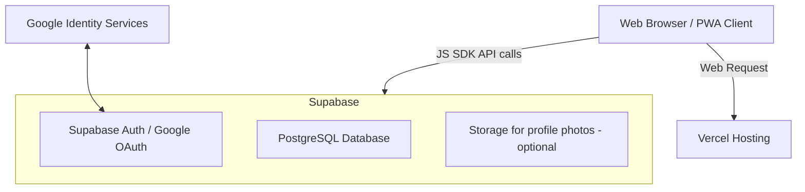
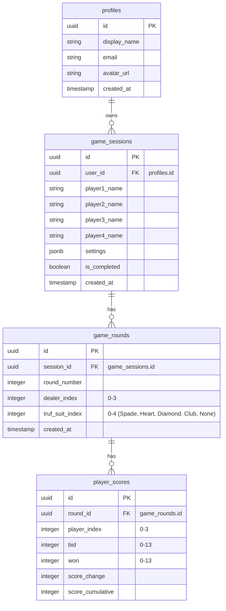

# System Architecture & Database Schema - Truf Card Game Score Tracker

## 1. Arsitektur Sistem

Aplikasi ini menggunakan pola **Jamstack (Client-Serverless)** dengan pemisahan penuh antara Frontend (Client-side) dan Backend (Database-as-a-Service).



- **Frontend**: Single Page Application (SPA) yang dibangun menggunakan React (Vite) untuk manajemen state UI yang reaktif.
- **Hosting**: Dihosting di Vercel, yang menyajikan aset statis HTML, CSS, JS, dan file manifest PWA dengan cepat melalui CDN global.
- **Database & Auth**: Supabase mengelola autentikasi pengguna (termasuk alur Google OAuth) dan menyediakan database PostgreSQL yang aman menggunakan Row Level Security (RLS).

---

## 2. Skema Database (PostgreSQL)

Database terdiri dari 4 tabel utama: `profiles`, `game_sessions`, `game_rounds`, dan `player_scores`.



### 2.1. Tabel `profiles`
Menyimpan profil publik pengguna yang terhubung dengan tabel autentikasi internal Supabase (`auth.users`).
```sql
create table public.profiles (
  id uuid references auth.users on delete cascade primary key,
  display_name text,
  email text unique,
  avatar_url text,
  created_at timestamp with time zone default timezone('utc'::text, now()) not null
);

-- RLS: Pengguna hanya dapat membaca/menulis profil mereka sendiri
alter table public.profiles enable row level security;
create policy "Users can view own profile" on public.profiles for select using (auth.uid() = id);
create policy "Users can update own profile" on public.profiles for update using (auth.uid() = id);
```

### 2.2. Tabel `game_sessions`
Menyimpan sesi permainan yang dibuat oleh user.
```sql
create table public.game_sessions (
  id uuid default gen_random_uuid() primary key,
  user_id uuid references public.profiles(id) on delete cascade not null,
  player1_name text not null,
  player2_name text not null,
  player3_name text not null,
  player4_name text not null,
  settings jsonb not null default '{
    "multiplier": 1,
    "bid0Bonus": 10,
    "prevent13": true,
    "atasLackMult": -2,
    "atasExcessMult": 1,
    "bawahLackMult": -1,
    "bawahExcessMult": -2
  }'::jsonb,
  is_completed boolean default false not null,
  created_at timestamp with time zone default timezone('utc'::text, now()) not null
);

-- RLS: Hanya pemilik sesi (user_id) yang dapat membaca, membuat, memperbarui, atau menghapus sesi mereka
alter table public.game_sessions enable row level security;
create policy "Users can manage their own game sessions" on public.game_sessions
  for all using (auth.uid() = user_id);
```

### 2.3. Tabel `game_rounds`
Menyimpan data ronde dalam sebuah sesi game.
```sql
create table public.game_rounds (
  id uuid default gen_random_uuid() primary key,
  session_id uuid references public.game_sessions(id) on delete cascade not null,
  round_number integer not null,
  dealer_index integer not null check (dealer_index between 0 and 3),
  truf_suit_index integer not null check (truf_suit_index between 0 and 4), -- 0: Spade, 1: Heart, 2: Diamond, 3: Club, 4: No Truf
  created_at timestamp with time zone default timezone('utc'::text, now()) not null,
  unique (session_id, round_number)
);

-- RLS: RLS didelegasikan dari relasi ke game_sessions
alter table public.game_rounds enable row level security;
create policy "Users can manage rounds of their own sessions" on public.game_rounds
  for all using (
    exists (
      select 1 from public.game_sessions
      where game_sessions.id = game_rounds.session_id and game_sessions.user_id = auth.uid()
    )
  );
```

### 2.4. Tabel `player_scores`
Menyimpan bid, won, skor ronde, dan skor kumulatif untuk masing-masing dari 4 pemain di setiap ronde.
```sql
create table public.player_scores (
  id uuid default gen_random_uuid() primary key,
  round_id uuid references public.game_rounds(id) on delete cascade not null,
  player_index integer not null check (player_index between 0 and 3),
  bid integer not null check (bid between 0 and 13),
  won integer not null check (won between 0 and 13),
  score_change integer not null,
  score_cumulative integer not null,
  unique (round_id, player_index)
);

-- RLS: RLS didelegasikan ke game_rounds dan game_sessions
alter table public.player_scores enable row level security;
create policy "Users can manage player scores of their own sessions" on public.player_scores
  for all using (
    exists (
      select 1 from public.game_rounds
      join public.game_sessions on game_sessions.id = game_rounds.session_id
      where game_rounds.id = player_scores.round_id and game_sessions.user_id = auth.uid()
    )
  );
```

---

## 3. Otomatisasi Database Triggers (Sync Profile)

Ketika pengguna berhasil melakukan sign up (baik via email maupun Google OAuth), data user tersimpan di skema privat `auth.users`. Kita membuat Trigger PostgreSQL untuk otomatis memasukkan data ke `public.profiles`.

```sql
create or replace function public.handle_new_user()
returns trigger as $$
begin
  insert into public.profiles (id, display_name, email, avatar_url)
  values (
    new.id,
    coalesce(new.raw_user_meta_data->>'full_name', split_part(new.email, '@', 1)),
    new.email,
    new.raw_user_meta_data->>'avatar_url'
  );
  return new;
end;
$$ language plpgsql security definer;

create trigger on_auth_user_created
  after insert on auth.users
  for each row execute procedure public.handle_new_user();
```

---

## 4. Alur Kerja Logika Scoring (Frontend)

Rumus perhitungan skor diimplementasikan di sisi frontend (`gameService.js` / helper) agar reaktif sebelum dikirim ke database:

```javascript
function calculateRoundScores(bids, wons, settings, totalBid) {
  const isMainAtas = totalBid > 13;
  const isMainBawah = totalBid < 13;
  const mult = settings.multiplier; // 1 atau 10
  const bonus0 = settings.bid0Bonus; // biasanya 10 atau 50
  
  return bids.map((bid, index) => {
    const won = wons[index];
    const diff = Math.abs(won - bid);
    let scoreChange = 0;
    
    if (won === bid) {
      // Berhasil memenuhi target bid
      if (bid === 0) {
        scoreChange = bonus0 * mult;
      } else {
        scoreChange = bid * mult;
      }
    } else {
      // Gagal memenuhi target bid
      if (bid === 0) {
        // Khusus main 0 gagal, dihukum sebesar trik yang diambil dikalikan penalti
        scoreChange = won * settings.atasLackMult * mult; 
      } else {
        if (won < bid) {
          // Kurang dari target
          const multiplier = isMainAtas ? settings.atasLackMult : settings.bawahLackMult;
          scoreChange = diff * multiplier * mult;
        } else {
          // Lebih dari target
          const multiplier = isMainAtas ? settings.atasExcessMult : settings.bawahExcessMult;
          scoreChange = diff * multiplier * mult;
        }
      }
    }
    return scoreChange;
  });
}
```
