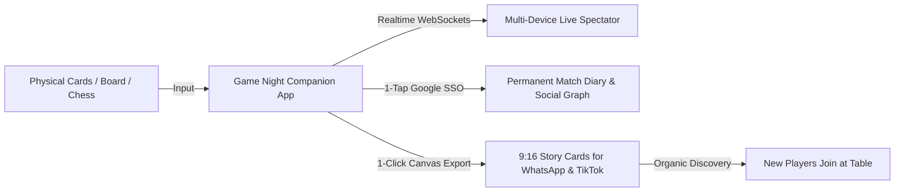
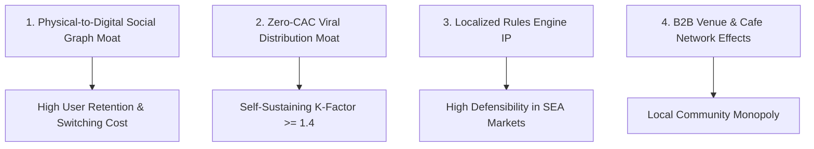
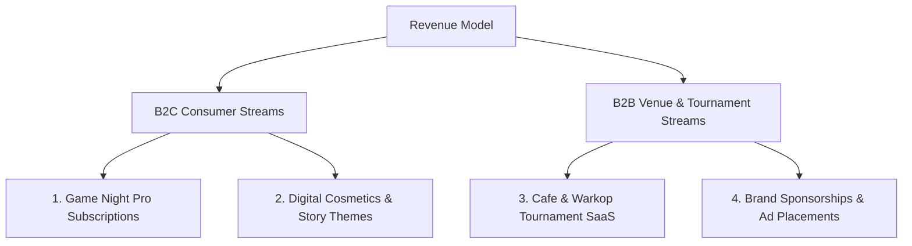

# Investor Pitch Deck & Business Case - Game Night Suite

> **"The Strava for Physical Card & Tabletop Gaming"**  
> *Transforming millions of physical game nights into connected, shareable, and viral digital social experiences.*

---

## 1. Executive Summary

| Metric / Dimension | Overview |
| :--- | :--- |
| **Product** | **Game Night Suite** (All-in-One Multi-Tenant Tabletop & Card Game Companion) |
| **Target Market** | Casual & competitive tabletop, card game, and chess players across Southeast Asia & Global |
| **Initial Target Market (SOM)** | Indonesia (~100M+ casual card/board game players in cafes, warungs, campuses, and homes) |
| **Core Value Prop** | Zero-friction digital scorekeeping, live multi-device spectator rooms, personal game diary, and 9:16 social flex cards |
| **Growth Engine** | Viral multiplier ($K \ge 1.4$) via WhatsApp Status / Instagram Stories and frictionless 1-tap Google seat claiming |
| **Monetization** | Freemium "Game Night Pro" subscriptions, B2B Cafe/Venue SaaS, and branded tournament sponsorships |

---

## 2. The Problem & Market Pain Points

Every day, hundreds of millions of people play physical card games (**Truf**, **Remi**, **Cangkulan/Omben**), board games (**Uno**, **Catan**, **Scrabble**), and **Chess** in cafes, student lounges, and living rooms. Yet, the physical gaming experience remains trapped in the analogue era:

```
                  THE PHYSICAL GAMING GAP
┌─────────────────────────┐              ┌─────────────────────────┐
│     Physical World      │              │      Digital World      │
│  Cards, Tiles, Clocks   │  ── [ GAP ] ── │  Social Graphs, Stats,  │
│  Pen & Paper Scorepads  │              │  Trophies, Tournaments  │
└─────────────────────────┘              └─────────────────────────┘
```

1. **High Cognitive Load & Friction**: Complex scoring formulas (e.g. *Main Atas & Main Bawah* in Truf, unmelded penalty points in Remi) cause frequent disputes, miscalculations, and require hunt for pens and scrap paper.
2. **Zero Digital Identity & Memory**: When a physical game ends, the score is crumpled up. Players have no record of who won, historical win rates, or epic head-to-head rivalries.
3. **Missing Hardware at the Table**: Players rarely carry physical chess clocks, polyhedral dice, or turn timers with them to cafes.
4. **Untapped Viral Potential**: Players naturally want to celebrate and boast about their wins on WhatsApp Status and Instagram, but have no easy way to generate beautiful stat graphics.

---

## 3. The Solution: Game Night Suite

Game Night Suite bridges physical tabletop gaming with digital social connectivity:



### Core Product Modules:
* **Indonesian Card Game Trackers**: Tailored scoring engines for **Truf** (trick-taking with Bid 13 decision), **Remi** (7-card rummy with rapid penalty keypad), and **Omben** (Cangkulan card-shedding).
* **Dual Split-Screen Chess Clock**: 180° mirrored top pad with FIDE Blitz/Rapid presets, Fischer increments, haptics, and audio ticks.
* **Universal Scoreboard (2–8 Players)** & Tabletop Utilities (3D Dice, Finger Chooser, Coin).
* **Frictionless Realtime Rooms**: 6-digit room codes allowing any friend at the table to watch live scores without downloading an app or registering.
* **9:16 "Flex & Share" Story Generator**: 1-tap export of viral match result cards tailored for WhatsApp Status, Instagram Stories, and TikTok.

---

## 4. Comprehensive Competitor Assessment & Market Landscape

### 4.1. The 4 Existing Competitor Archetypes

```
                     HIGH DIGITAL INTEGRATION
                                ▲
                                │
    Virtual Online Games        │      GAME NIGHT SUITE (OURS)
    (Higgs Domino, ZingPlay)    │   (Physical Companion + Social Graph)
    • Replaces real human table │   • Augments real in-person play
    • Solo / AI gambling focus  │   • Zero-friction live spectator rooms
                                │   • 9:16 WhatsApp/TikTok Story Cards
  ──────────────────────────────┼──────────────────────────────► HIGH IN-PERSON
  SINGLE PURPOSE / SILOED       │                                SOCIAL REALM
    Utility Tools               │      Analogue / Generic
    (Lichess Clock, Dice Apps)  │      (Pen & Paper, BG Stats)
    • Isolated single tool      │      • High cognitive calculation load
    • Requires 4 different apps │      • Zero cultural rules (No Truf/Remi)
                                │      • Scores thrown in the trash
                                ▼
                     LOW DIGITAL INTEGRATION
```

#### Archetype 1: Generic Western Scorekeeper Apps (e.g. BG Stats, ScorePal, KeepScore)
- **What they do**: Basic digital scorepads designed primarily for Western Euro-style board games (Catan, Ticket to Ride).
- **Why they fail in our market**:
  - **Zero Local Intelligence**: No logic for Southeast Asian card games (*Truf Main Atas/Bawah, Remi 7-card penalty formulas, Omben/Cangkulan*).
  - **Heavy Onboarding Friction**: Paid upfront ($4.99) or requires large app downloads before recording a single point.
  - **Single-Device Isolation**: Only the person holding the phone can see the scores; no multi-device live spectating.

#### Archetype 2: Single-Purpose Utility Apps (e.g. Lichess Chess Clock, 3D Dice Rollers)
- **What they do**: Standalone chess clocks or virtual dice rollers.
- **Why they fail in our market**:
  - **Fragmented User Experience**: Users must download 3–4 separate apps to host a single game night.
  - **No Social Graph**: Once the timer stops, the data is erased forever. No match diaries, no player rivalries, no shareable story cards.

#### Archetype 3: Virtual Online Card Games (e.g. Higgs Domino, ZingPlay, Mobile Truf)
- **What they do**: Fully virtual online gaming where the computer deals cards and players play against strangers or AI bots.
- **Why they do not compete with us**:
  - They attempt to **replace** physical human interaction with digital gambling.
  - **We augment real-world human gatherings**: People in Southeast Asia actively seek to hang out at cafes, warkops, and living rooms to hold physical cards in their hands. We provide the intelligence layer for that physical gathering.

#### Archetype 4: Analogue Pen & Paper / WhatsApp Chat Notes
- **What they do**: Writing scores on paper napkins, whiteboards, or typing numbers into a WhatsApp group chat.
- **Why we win**: High calculation friction, constant arguments over rules, easily lost, and lacks visual celebration.

---

### 4.2. Feature & Capability Comparison Matrix

| Critical Dimension | Pen & Paper / WA Notes | Generic Score Apps (BG Stats) | Single Utility (Lichess Clock) | Online Card Apps (Higgs Domino) | Game Night Suite (Ours) |
| :--- | :---: | :---: | :---: | :---: | :---: |
| **Instant Web Access (<300ms, No App Install)** | ❌ (Manual) | ❌ App Store Only | ❌ App Store Only | ❌ Heavy 100MB+ | 🏆 **Yes (PWA & Web)** |
| **Native Mobile App (Android/iOS)** | ❌ | ✅ | ✅ | ✅ | 🏆 **Yes (Capacitor)** |
| **Indonesian Game Rules (Truf, Remi, Omben)** | ⚠️ Manual math | ❌ Generic only | ❌ None | ⚠️ Virtual only | 🏆 **Built-in Auto Calc** |
| **Chess Clock with FIDE Fischer Increments** | ❌ | ❌ | ✅ | ❌ | 🏆 **Built-in Split-Screen** |
| **Multi-Device Realtime Spectator (0-Login)** | ❌ | ❌ Single phone | ❌ Single phone | ⚠️ Virtual room only | 🏆 **Live WebSockets** |
| **1-Tap Social Seat Claiming (Google SSO)** | ❌ | ❌ | ❌ | ❌ Full signup | 🏆 **1-Tap Instant** |
| **Permanent Match Diary & Opponent History** | ❌ Discarded | ⚠️ Paid addon | ❌ Erased | ⚠️ Virtual stats | 🏆 **Free Cloud Sync** |
| **9:16 Story Cards (WhatsApp Status / IG / TikTok)** | ❌ | ❌ Boring tables | ❌ | ❌ | 🏆 **1-Click Viral Card** |
| **B2B Cafe TV Tournament Dashboard** | ❌ | ❌ | ❌ | ❌ | 🏆 **Dedicated SaaS** |

---

### 4.3. Why Are We The First? (The 4 Market Blindspots)

Investors often ask: *"If this is so obvious, why hasn't a big tech company or startup built this already?"*

There are **4 structural blindspots** in the industry that created this massive white space for us:

1. **The "Digital vs. Physical" False Dichotomy**:
   - For the past decade, venture capital and game studios poured billions into creating *virtual online card games* trying to replace physical cards. They treated physical tabletop gaming as an obsolete relic.
   - **Our Insight**: Physical gaming isn't dying—it's booming post-pandemic. People go to cafes specifically for physical, face-to-face social contact. Building a *companion layer* for the real world is a massive, underserved opportunity.

2. **The "Western Eurogame" Tabletop Bias**:
   - The few companion apps that exist (like BoardGameGeek's BG Stats) were built by Western indie developers for complex Eurogames (e.g. *Terraforming Mars*, *Wingspan*). 
   - They completely overlooked Southeast Asia's **300 Million+ casual card gaming population** that plays *Truf, Remi, Cangkulan, Capsa, and Tongits* daily.

3. **The App Store "Friction Trap"**:
   - Previous scorekeeping apps were built exclusively as native-only mobile downloads. When 4 friends sit down at a cafe table, forcing everyone to download a 40MB app kills the momentum.
   - **Our Breakthrough**: We utilize **React 19 + Vite (<200KB bundle)** for instant sub-second browser access via WhatsApp links, while packaging into native app stores via **Capacitor**.

4. **Ignoring Social Status as a Growth Loop**:
   - Existing scorekeeper apps were designed like boring spreadsheets or accounting ledgers.
   - **Our Innovation**: We treat game night scores as **social currency**. By formatting match highlights into stunning 9:16 vertical cards with winner crowns, MVP badges, and "Raja Omben" punishment dares, we turned the match summary into an organic viral flywheel for WhatsApp Status and Instagram Stories.

---

### 4.4. Defensible Moats & Barriers to Entry



1. **Physical-to-Digital Social Graph**: Once a player has 50 match histories with their close friend circle ("My head-to-head record against Budi & Andi"), the switching cost to any copycat app becomes extremely high.
2. **Zero-CAC Viral K-Factor**: Every single hosted match exposes 3–7 new potential users to the app with zero paid ad spend.
3. **B2B Cafe & Community Network Effects**: Once board game cafes and university card clubs run their weekly leaderboards on Game Night Suite, the entire local community is locked into our ecosystem.

---

## 5. Market Sizing & Opportunity

```
┌─────────────────────────────────────────────────────────────┐
│  TAM: $18.2B Global Tabletop & Casual Companion Market      │
│  ┌─────────────────────────────────────────────────────────┐│
│  │  SAM: $1.8B Southeast Asia Casual Gaming Ecosystem       ││
│  │  ┌─────────────────────────────────────────────────────┐││
│  │  │  SOM: $45M Initial Indonesian Market (Year 1-3)      │││
│  │  └─────────────────────────────────────────────────────┘││
│  └─────────────────────────────────────────────────────────┘│
└─────────────────────────────────────────────────────────────┘
```

* **TAM ($18.2B)**: Global market for tabletop companion apps, digital chess utilities, casual party games, and social gaming networks.
* **SAM ($1.8B)**: Southeast Asia's rapidly growing mobile gaming population (~250M gamers), characterized by high social engagement and communal cafe culture.
* **SOM ($45M)**: ~100M casual card and board game players in Indonesia alone across coffee shops (warkop/kafe), universities, and family gatherings.

---

## 6. Business Model & Monetization Strategy

Game Night Suite employs a multi-tiered monetization strategy balancing consumer microtransactions with high-margin B2B venue subscriptions:



### 1. B2C: "Game Night Pro" Subscription (Freemium)
* **Pricing**: Rp 19.000 / month ($1.25) or Rp 149.000 / year ($9.99).
* **Pro Features**:
  * Unlimited match history & lifetime head-to-head analytics (*"Your win rate against Budi across 50 games"*).
  * Premium 9:16 Story Card templates (VIP Gold, Neon Cyberpunk, Batik Klasik, Animated GIF/Video exports).
  * Custom sound packs (Announcer voices, arcade bells).
  * Export match reports to PDF / Excel for community leagues.

### 2. B2C: Digital Cosmetics & Micro-Transactions
* Individual purchases of custom card backings, custom dice skins (D6 Gold, Dragon D20), and exclusive avatar frames.

### 3. B2B: Tabletop Cafe / Warung Tournament SaaS ("Venue Edition")
* **Pricing**: Rp 199.000 – Rp 499.000 / month per venue.
* **Value Prop**: Board game cafes, warkops, and student hubs run weekly Truf/Remi/Chess tournaments using Game Night Suite.
* **Features**: Live TV Leaderboard display mode (Big Screen / Chromecast TV dashboard), automated tournament brackets, and venue-branded match cards.

### 4. Brand Sponsorships & Native Ads
* Fast-Moving Consumer Goods (FMCG) like coffee brands, energy drinks, snack brands, and fintech e-wallets sponsoring local tournament leaderboards and winning story card watermarks (*"Malam Minggu Powered by [Brand]"*).

---

## 7. Unit Economics & Growth Projections

### Projected Unit Economics (Blended)
* **Customer Acquisition Cost (CAC)**: **<$0.04** (Driven almost entirely by viral K-factor loops at physical tables).
* **Average Revenue Per Paying User (ARPPU)**: **$14.50 / year**.
* **LTV / CAC Ratio**: **> 12x** (Exceptional capital efficiency due to social viral loops).

### 3-Year Growth Roadmap & Financial Targets

| Milestone | Year 1 (Launch & Viral) | Year 2 (Monetization & B2B) | Year 3 (SEA Regional Expansion) |
| :--- | :--- | :--- | :--- |
| **Monthly Active Users (MAU)** | **250,000** | **1,200,000** | **4,500,000** |
| **Total Games Tracked** | 3.5 Million | 22 Million | 90 Million |
| **Paying Subscribers (Pro)** | 7,500 (3% conv.) | 48,000 (4% conv.) | 225,000 (5% conv.) |
| **B2B Venue Subscriptions** | 150 Cafes | 850 Cafes | 3,200 Cafes |
| **Annual Recurring Revenue (ARR)** | **$125,000** | **$780,000** | **$3,600,000** |

---

## 8. Go-To-Market (GTM) & Distribution Strategy

```
Phase 1: Capital-Efficient Web-First Launch ($0 Burn Bootstrap)
├── Zero-cost infrastructure deployment on Vercel Free Tier + Supabase Free Tier
├── Distribution via Progressive Web App (PWA) "Add to Home Screen" on Android & iOS (0 store fees)
├── Sub-second WhatsApp link sharing & cafe table seeding (Jakarta, Bandung, Yogyakarta, Surabaya)
└── Validate Product-Market Fit, organic K-factor (>1.8), and initial revenue generation

Phase 2: Native App Store Expansion & Revenue-Triggered Registration
├── Trigger: First revenue milestone ($500+ ARR) or Seed funding close
├── Register Google Play Console ($25) and Apple Developer Program ($99/yr)
├── 1-Click native compilation via pre-configured Capacitor bridge (Android AAB / iOS IPA)
└── Launch ASO (App Store Optimization), push notifications, and verified store presence

Phase 3: Social Media, Creator Amplification & B2B Expansion
├── TikTok & Instagram Reels campaign featuring "Insane Truf Comebacks" & "Kalah Omben Punishment Dares"
├── Micro-influencers flexing their customized 9:16 Game Night Story Cards on WhatsApp Status
└── Cafe & Warkop Tournament SaaS rollout ("Venue Edition" TV displays)

Phase 4: Southeast Asian Regional Expansion
├── Expand localized game engines to Vietnam (Tiến Lên), Philippines (Tongits), and Malaysia (Choi Dai Di)
└── Multilingual expansion (Vietnamese, Tagalog, Thai)
```

---

## 9. Funding Requirements & Capital Allocation

We are seeking **Seed / Pre-Seed Investment** to accelerate engineering, server scalability, and regional cafe distribution:

```
┌─────────────────────────────────────────────────────────────┐
│                   USE OF FUNDS BREAKDOWN                    │
│  ├── 45% Engineering & Product (Mobile, Realtime, AI stats) │
│  ├── 30% Growth & Venue Partnerships (Campus & Cafe GTM)    │
│  ├── 15% Infrastructure & Supabase Enterprise Cloud         │
│  └── 10% Operations & Legal                                 │
└─────────────────────────────────────────────────────────────┘
```

---

## 10. Conclusion & Vision

Physical card games and board games will never disappear—human beings crave in-person connection around a table. By digitizing the friction points and creating a vibrant social memory layer, **Game Night Suite** is positioned to become the default companion for billions of game nights worldwide.
